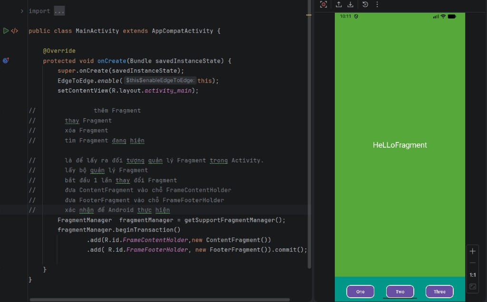

# Bài thực hành Fragment Dynamic

Project này minh họa cách làm việc với **Fragment động** trong Android:

- `MainActivity` dùng `FragmentManager` để gắn `ContentFragment` và `FooterFragment` vào các `FrameLayout`.
- Phần nội dung hiển thị text ở giữa màn hình.
- Phần footer có 3 nút thao tác ở cuối giao diện.

## Ảnh kết quả chạy ứng dụng

## Ghi chú

- Bài được viết bằng Java + XML layout.
- Mục tiêu chính là hiểu quy trình thêm fragment bằng `beginTransaction().add(...).commit()`.
