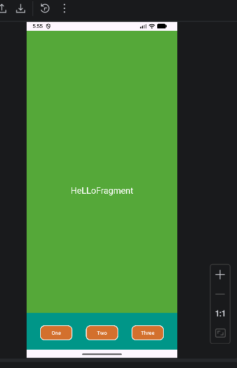

# Bài tập Fragment Static - Android

Project này minh hoa cach dung **Static Fragment**: `MainActivity` chua san 2 fragment trong XML, gom:
- `ContentFragment`: khu vuc noi dung chinh (nen xanh, text giua man hinh)
- `FooterFragment`: thanh footer duoi cung voi 3 nut `One`, `Two`, `Three`

## Anh doi chieu (de bai va ket qua)

| De bai mau | Ket qua app |
|---|---|
|  |  |

> Ghi nho nhanh: bai nay tap trung vao ky thuat dat 2 fragment co dinh trong layout, khong phai clone UI RSS 100%.

## Y nghia tung file code chinh

### `app/src/main/java/hung/edu/fragmentexstatic/MainActivity.java`
- Entry point cua app.
- `setContentView(R.layout.activity_main)` nap layout chinh.
- `EdgeToEdge.enable(this)` + `WindowInsets` giup noi dung tranh de len thanh status/navigation tren may moi.
- Activity nay **khong tu tao fragment bang code** vi fragment da khai bao san trong XML.

### `app/src/main/res/layout/activity_main.xml`
- La khung giao dien tong.
- Chua 2 the `<fragment>`:
  - `frgNoiDung` -> `ContentFragment`, chiem phan lon man hinh.
  - `frgChanTrang` -> `FooterFragment`, neo duoi cung.
- Constraint `Bottom_toTopOf` giup noi dung o tren footer, va footer luon sat day man hinh.

### `app/src/main/java/hung/edu/fragmentexstatic/ContentFragment.java`
- Fragment hien thi noi dung trung tam.
- `onCreateView(...)` tra ve layout `fragment_content.xml`.
- Cac bien `ARG_PARAM1/ARG_PARAM2`, `newInstance(...)` la mau sinh tu Android Studio; bai hien tai chua can dung den.

### `app/src/main/res/layout/fragment_content.xml`
- Nen xanh (`android:background="#55A839"`).
- 1 `TextView` can giua bang constraint 4 canh ve parent.
- Text `HeLLoFragment` de nhan biet vung noi dung.

### `app/src/main/java/hung/edu/fragmentexstatic/FooterFragment.java`
- Fragment footer.
- `onCreateView(...)` nap `fragment_footer.xml`.
- Giong `ContentFragment`, phan tham so trong `newInstance(...)` la khung co san, co the toi gian hoa sau.

### `app/src/main/res/layout/fragment_footer.xml`
- Thanh footer mau xanh ngoc.
- Co 3 nut `Button`: `One`, `Two`, `Three`.
- Su dung `ConstraintLayout` de canh nut nam tren cung 1 hang o day man hinh.

### `app/src/main/res/values/strings.xml`
- Chua chuoi chu de tai su dung va ho tro da ngon ngu.
- `app_name` la ten ung dung hien thi.

### `app/src/main/AndroidManifest.xml`
- Khai bao `MainActivity` la man hinh mo dau (`MAIN` + `LAUNCHER`).
- Gan theme ung dung.

## Luong chay de de nho

1. Android mo `MainActivity`.
2. `MainActivity` nap `activity_main.xml`.
3. He thong tao 2 fragment theo khai bao trong XML:
   - `ContentFragment` -> ve vung noi dung.
   - `FooterFragment` -> ve thanh footer.
4. Ket qua: man hinh chia 2 phan co dinh (noi dung + chan trang).

## Cach chay lai project

```bash
cd FragmentExStatic
./gradlew assembleDebug
```

Neu build thanh cong, chay app tren emulator/deivce se ra giao dien nhu anh ket qua.
