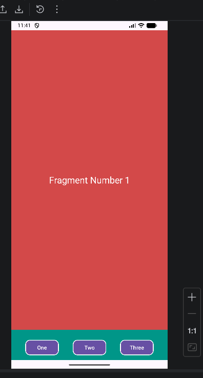
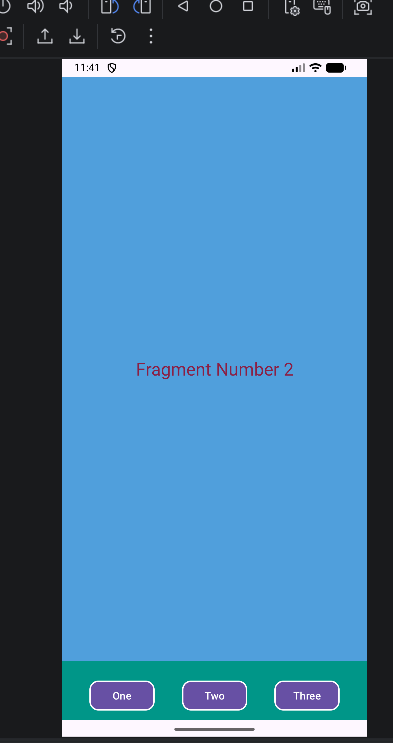
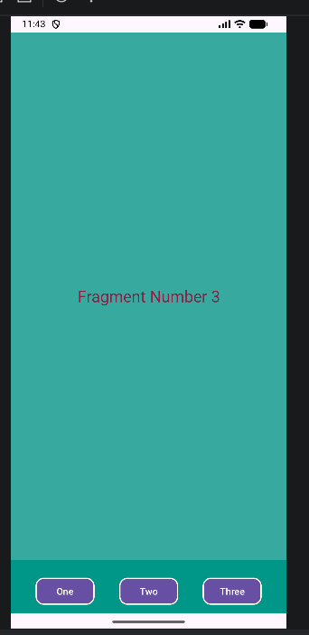
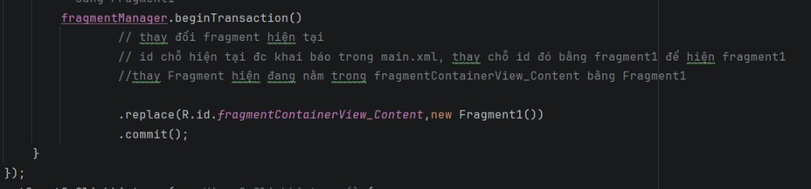

# Demo Thay Fragment Bằng 3 Nút

Ứng dụng gồm 2 khu vực chính:
- `ConTentFragment`: vùng nội dung ở phía trên màn hình.
- `FooterFragment`: thanh 3 nút ở phía dưới (`One`, `Two`, `Three`).

Khi bấm mỗi nút, app sẽ thay Fragment trong vùng nội dung bằng lệnh `replace(...)`.

## Kết Quả Khi Bấm Nút

- Bấm `One` -> hiện `Fragment Number 1` (nền đỏ).
- Bấm `Two` -> hiện `Fragment Number 2` (nền xanh dương).
- Bấm `Three` -> hiện `Fragment Number 3` (nền xanh ngọc).

## Ảnh Minh Họa

### Bấm nút One


### Bấm nút Two


### Bấm nút Three


### Đoạn code replace (ảnh đen)


## Giải Thích Dễ Hiểu Đoạn Code Ở Ảnh Đen

Đoạn code cần hiểu:

```java
fragmentManager.beginTransaction()
        .replace(R.id.fragmentContainerView_Content, new Fragment1())
        .commit();
```

Giải thích từng dòng:

- `fragmentManager`  
  Là bộ quản lý Fragment. Trong bài này, nó được lấy bằng `getParentFragmentManager()`.

- `beginTransaction()`  
  Bắt đầu một giao dịch thay đổi Fragment. Có thể hiểu là "mở phiên cập nhật giao diện".

- `.replace(R.id.fragmentContainerView_Content, new Fragment1())`  
  - `R.id.fragmentContainerView_Content`: id của vùng đang hiển thị nội dung trong `activity_main.xml`.
  - `new Fragment1()`: tạo đối tượng Fragment mới.
  - `replace(...)`: thay Fragment đang hiển thị trong khung bằng Fragment mới.

- `.commit()`  
  Xác nhận và thực thi giao dịch. Nếu thiếu dòng này thì màn hình sẽ không đổi.

Tóm gọn luồng chạy: bấm nút -> tạo Fragment tương ứng -> `replace` vào `fragmentContainerView_Content` -> giao diện cập nhật.

## Các File Chính

- `app/src/main/java/hung/edu/fragmentex_replace/FooterFragment.java`: bắt sự kiện 3 nút và gọi `replace`.
- `app/src/main/res/layout/activity_main.xml`: định nghĩa 2 `FragmentContainerView` (content + footer).
- `app/src/main/res/layout/fragment_1.xml`: giao diện Fragment 1.
- `app/src/main/res/layout/fragment_2.xml`: giao diện Fragment 2.
- `app/src/main/res/layout/fragment_3.xml`: giao diện Fragment 3.

