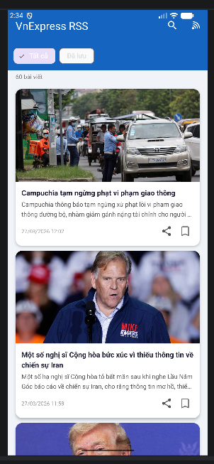

Lưu bài tập thực hành Android

## Quá trình thực hiện bài tập

### Bài tập 11: rss Đọc báo tổng hợp 

[Chi tiết bài tập](./rss)

*Ứng dụng đọc báo tổng hợp từ các nguồn RSS, hiển thị danh sách tin tức và xem nội dung chi tiết.*

---

### MÔ TẢ KHỐI LÝ THUYẾT & KIẾN TRÚC CODE (RSS Reader Workflow)

Ứng dụng **DocBaoTongHop** được thiết kế dựa trên mô hình danh sách hiển thị dữ liệu tuỳ biến từ nguồn internet. Dưới đây là các luồng làm việc và lý thuyết cốt lõi của các class chính:

#### 1. `MainActivity` (Luồng chính và Giao diện)
- Là Controller quản lý giao diện chính (View). Nó khởi tạo danh sách `RecyclerView` và liên kết với Layout LayoutManager. 
- Tại đây sẽ thực thi việc chuyển category tin tức (như Thời sự, Thế giới,...), và cũng là nơi kích hoạt quá trình tải tin. 
- Khi người dùng muốn xem báo hoặc thay đổi trang, Activity gọi luồng xử lý `FetchRssTask` (luồng nền) để không làm đơ giao diện chính.

#### 2. `FetchRssTask` (Xử lý Đa luồng & Mạng)

- Lý thuyết xử lý bất đồng bộ (Asynchronous): Do việc tải dữ liệu từ internet tốn thời gian, Android không cho phép chạy tác vụ mạng trên Main Thread (UI Thread).

- Kế thừa `AsyncTask` hoặc sử dụng `ExecutorService/Coroutine`. Nó làm nhiệm vụ kết nối tới cấu trúc đường dẫn RSS của báo mạng (như VnExpress), nhận InputStream của XML và truyền sang cho bộ phân tích.

#### 3. `RssParser` (Bộ phân tích cú pháp dữ liệu)

- Dữ liệu trả về từ nguồn RSS là định dạng XML. `RssParser` (thường dùng DocumentBuilder, XmlPullParser hoặc SAX Parser) sẽ phân tích (parse) chuỗi văn bản XML đó.

- Công việc của nó là tìm các thẻ `<item>`, lấy thẻ `<title>` (Tiêu đề), `<description>` (Mô tả và Hình ảnh), `<link>` (Đường dẫn tin), và `<pubDate>` (Thời gian).
- Chuyển đổi các thông tin thô này thành các Object (Đối tượng kiểu `NewsItem` hay `RssItem`) để lưu vào danh sách (List).

#### 4. `RssAdapter` (Bộ chuyển đổi dữ liệu lên giao diện)

- Kế thừa `RecyclerView.Adapter`. Công dụng là biến các Object `NewsItem` (từ RssParser) thành các View con hiển thị trên màn hình.

- Ứng dụng mô hình `ViewHolder` để tái sử dụng các CardView (thay vì phải tạo View mới khi cuộn danh sách), giúp danh sách cuộn mượt mà và tiết kiệm RAM. Lớp này gán dữ liệu tiêu đề, load ảnh bìa bằng thư viện (Picasso/Glide) lên các phần tử giao diện hiển thị.

#### 5. `BookmarkManager` (Lưu trữ và Đánh dấu)
- Khi người dùng nhấn lưu một tin (Bookmark), hệ thống sử dụng **SharedPreferences** (hoặc SQLite/Room Database) để lưu vết tin tức dưới dạng text hoặc chuỗi JSON.
- Ưu điểm: Hệ thống lưu trữ này nhẹ nhàng, dữ liệu được giữ lại ngay cả khi tắt ứng dụng đi mở lại. Cơ chế này được tích hợp song song và cập nhật liền mạch bằng `Adapter`.

---
*Sinh viên thực hiện: [Nguyễn Văn Hưng]*
*MSSV: [65131205]*
