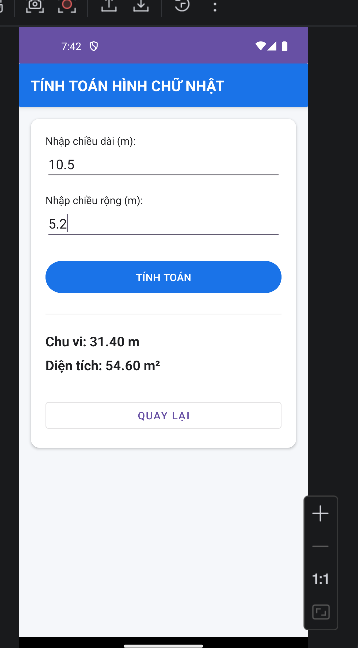
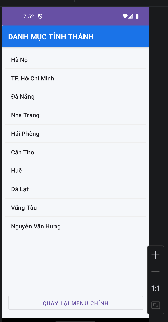
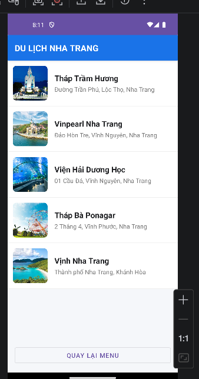

# BÀI THI GIỮA KỲ 2 - MÔN LẬP TRÌNH DI ĐỘNG

## Thông tin sinh viên
- **Họ và tên**: Nguyễn Văn Hưng
- **MSSV**: 65131205
- **Lớp**: 65.CNTT-2
- **Ngày thi**: 20/04/2026

## Giới thiệu ứng dụng
Ứng dụng được xây dựng theo kiểu **Single-Activity** với **Bottom Navigation**, bao gồm:
1. **Hình học**: Tính toán Chu vi và Diện tích hình chữ nhật.
2. **Tỉnh thành**: Danh mục 10 tỉnh thành của Việt Nam.
3. **Du lịch**: Top 5 địa điểm du lịch tại Nha Trang (có ảnh).
4. **Cá nhân**: Giới thiệu sinh viên (ảnh thẻ thật, MSSV, sở thích).

## Hình ảnh kết quả chạy ứng dụng
### 1. Màn hình chính

### 2. Chức năng tính toán (Chu vi & Diện tích)

### 3. Chức năng danh mục Tỉnh thành

### 4. Chức năng thông tin cá nhân

### 5. Chức năng du lịch Nha Trang

## Hướng dẫn cài đặt
1. Clone dự án về máy.
2. Mở bằng Android Studio.
3. Đồng bộ Gradle và chạy trên Emulator hoặc thiết bị thật.

---
*Ghi chú: Bài làm được thực hiện phân đoạn để đảm bảo chất lượng và đúng tiến độ.*
