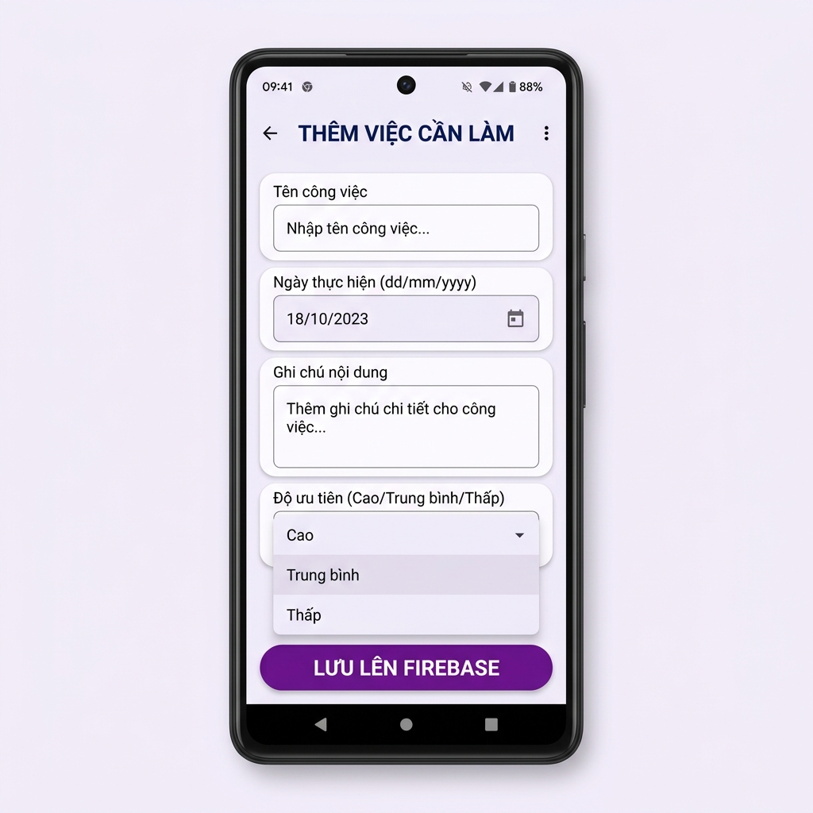
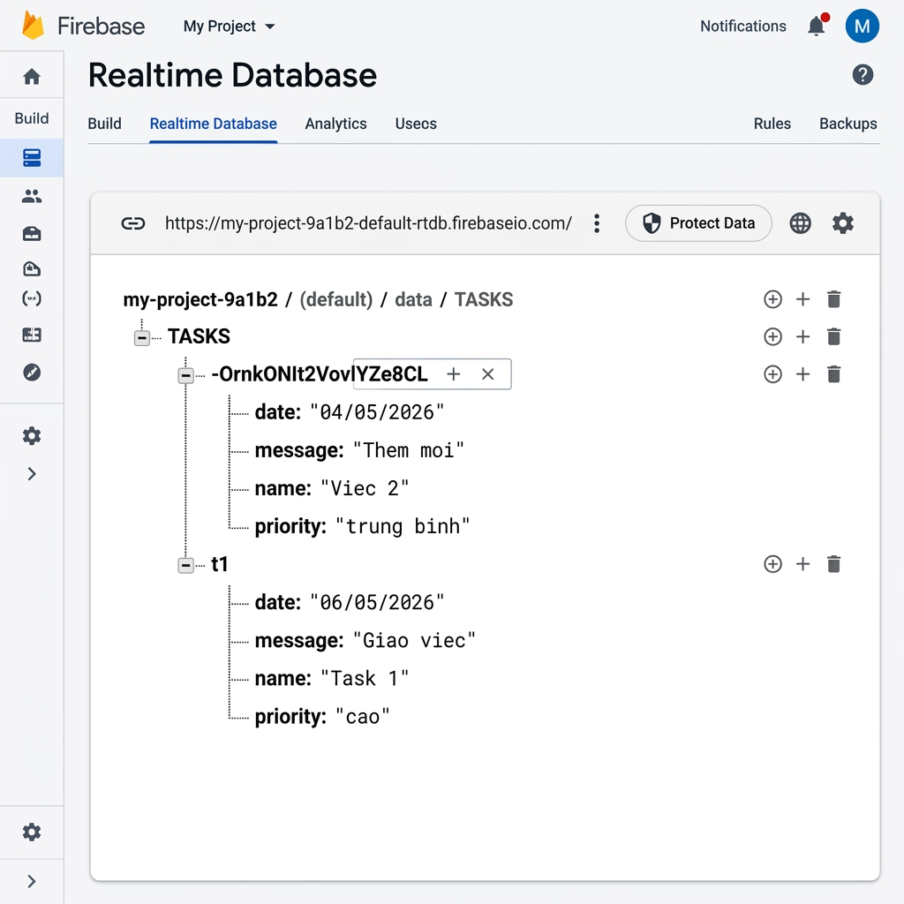

# Dự án: Việc Cần Làm - Phần 1 (ViecCanLamPhan1)

## Giới thiệu
Đây là ứng dụng Android đơn giản cho phép người dùng quản lý danh sách các việc cần làm. Trong phần này, ứng dụng đã được tích hợp với **Firebase Realtime Database** để lưu trữ dữ liệu trực tuyến.

## Các tính năng chính
- Nhập thông tin việc cần làm (Tên công việc, Ngày thực hiện, Ghi chú, Độ ưu tiên).
- Lưu trữ dữ liệu trực tiếp lên Firebase Realtime Database.
- Dữ liệu được đồng bộ hóa thời gian thực.

## Công nghệ sử dụng
- **Ngôn ngữ**: Java
- **Công cụ phát triển**: Android Studio
- **Backend**: Firebase Realtime Database
- **Gradle**: Kotlin DSL (libs.versions.toml)

## Kết quả đạt được

### 1. Giao diện ứng dụng
Ứng dụng có giao diện hiện đại, dễ sử dụng với các trường nhập liệu rõ ràng và nút bấm lưu dữ liệu.

### 2. Cấu trúc dữ liệu trên Firebase
Dữ liệu được tổ chức dưới dạng cấu trúc cây trong Firebase Realtime Database:

- `TASKS`
    - `{TaskID}`
        - `date`: Ngày thực hiện
        - `message`: Ghi chú nội dung
        - `name`: Tên công việc
        - `priority`: Độ ưu tiên

### Hình ảnh minh họa kết quả:
- **Giao diện App**: Cho phép nhập liệu và nhấn "LƯU LÊN FIREBASE".
- **Firebase Console**: Hiển thị các bản ghi đã được thêm thành công với ID tự động sinh (`-OrnkONIt2VovlYZe8CL`).

---
*Người thực hiện: hung090725*
