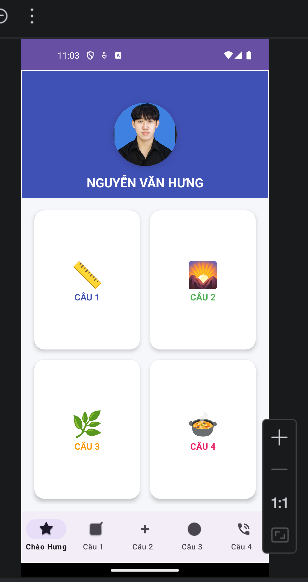
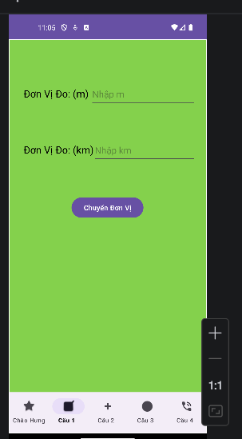
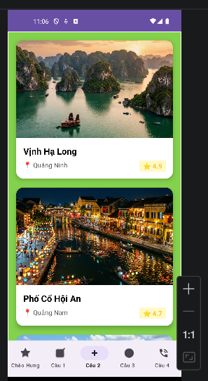
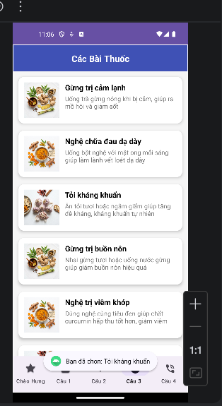
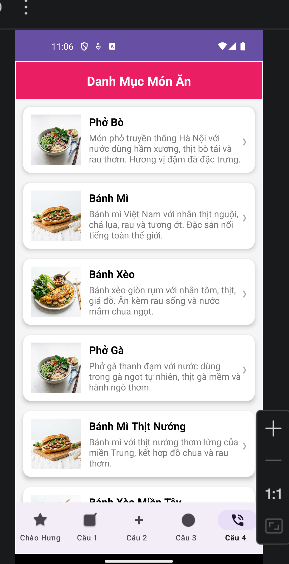
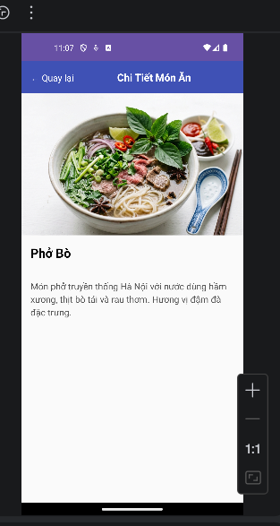

# Bài thi — Bottom Navigation (ChBaiThi)

Đây là app Android mình làm cho phần bài thi, dùng **Bottom Navigation** để chuyển giữa trang chào và các câu 1 → 4. Mỗi tab là một `Fragment` riêng, phần còn lại là list + adapter chỗ nào cần.

## Chạy thử

- Mở thư mục `btnNavigationBaiThi` bằng Android Studio (đây là project Gradle riêng, tên module trong `settings.gradle.kts` là **ChBaiThi**).
- Chọn cấu hình **app** rồi Run lên máy ảo hoặc điện thoại.

Yêu cầu chung: JDK 17, `minSdk` 24 (xem `app/build.gradle.kts`).

---

## Ảnh chụp màn hình (kết quả chạy thật)

### Ảnh 1 — Trang Home (Chào Hưng)

Lúc vào app sẽ thấy header có ảnh đại diện + tên, dưới là lưới 4 ô bấm nhanh sang Câu 1–4; thanh dưới cùng là menu 5 mục.

### Ảnh 2 — Câu 1

Màn đổi đơn vị **m ↔ km**: nhập một bên, bấm nút **Chuyển Đơn Vị** để quy đổi.

### Ảnh 3 — Câu 2

Danh sách cảnh đẹp dạng thẻ: có ảnh, tên địa điểm, tỉnh và điểm đánh giá. List kéo xuống được.

### Ảnh 4 — Câu 3

Màn **Các bài thuốc**: mỗi dòng là một bài thuốc dân gian, bấm vào thì có thông báo (toast) cho biết mình chọn dòng nào.

### Ảnh 5 — Câu 4 (danh mục món ăn)

Tiêu đề **Danh Mục Món Ăn**, list các món kèm mô tả ngắn; có mũi tên bên phải để gợi ý là bấm được.

### Ảnh 6 — Câu 4: sau khi bấm (món thứ 6 → chi tiết Phở Bò)

Ở list món ăn, mình **bấm vào dòng thứ 6** (trong bài là *Bánh Xèo Miền Tây*) thì app mở sang màn **Chi Tiết Món Ăn** và đang hiển thị nội dung **Phở Bò** (ảnh lớn + tên món + đoạn mô tả). Phần này dùng `Activity` chi tiết để tách khỏi fragment danh sách.

---

## Ghi chú nhanh

- Package: `hung.edu.chbaithi`
- Nếu clone cả repo `65131205-AndroidProgramming`, bài này nằm trong thư mục **`btnNavigationBaiThi/`** — không lẫn với project `ButtonNavigation` bên cạnh.

Mình để ảnh minh họa ngay trong repo (`docs/screenshots/`) để lên GitHub vẫn xem được trực tiếp trên trang README.
