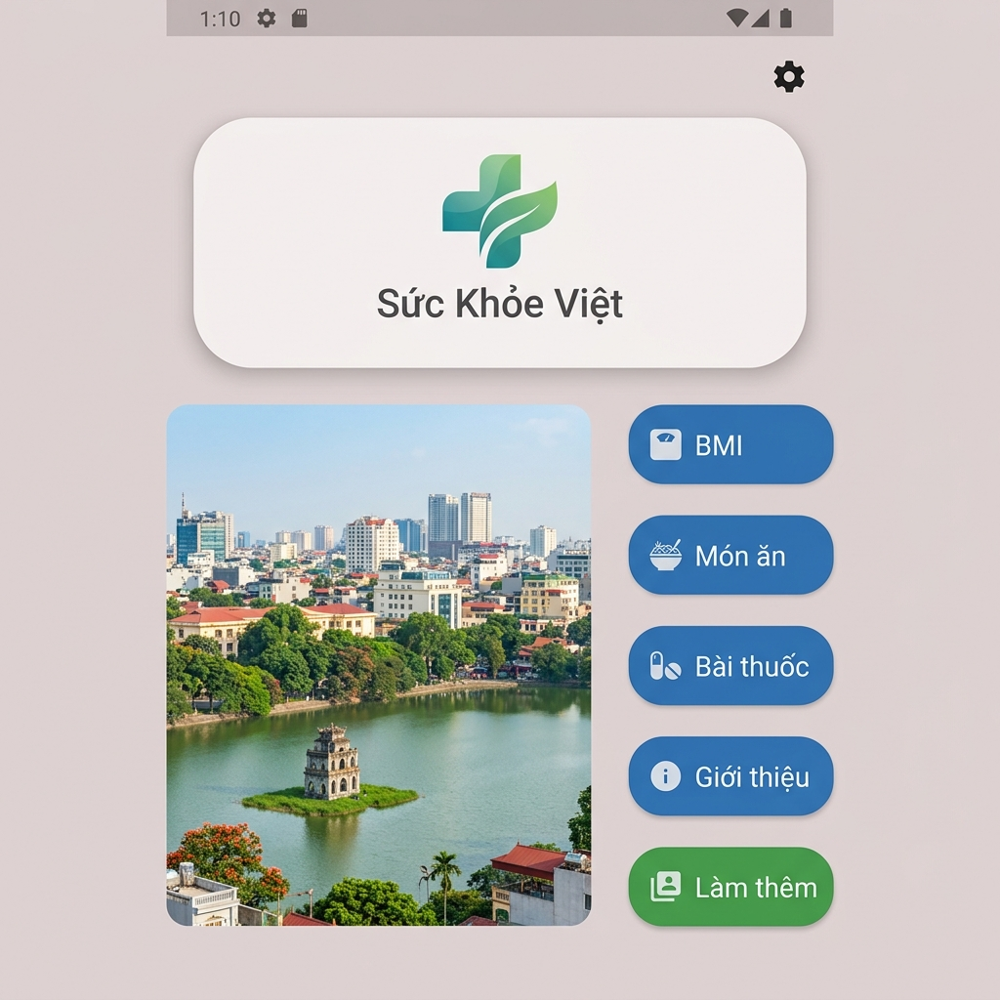
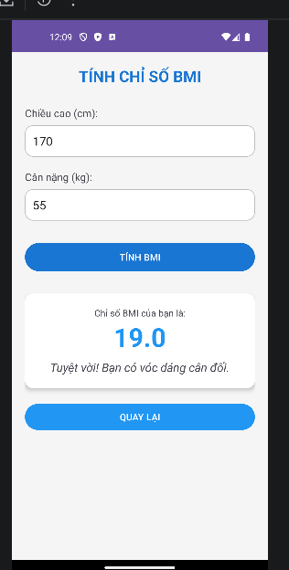
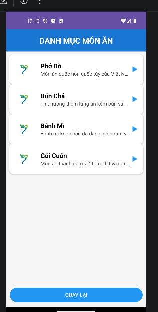
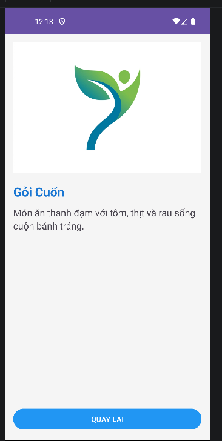
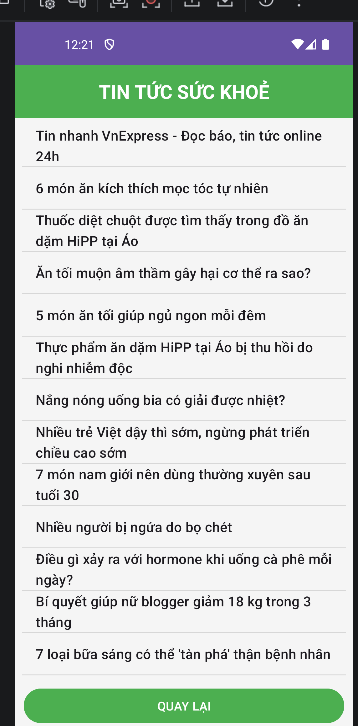

# BÁO CÁO DỰ ÁN THI GIỮA KỲ - LẬP TRÌNH ANDROID

## THÔNG TIN SINH VIÊN
- **Họ và tên:** Nguyễn Văn Hưng
- **Mã sinh viên:** 65131205
- **Lớp:** 65.CNTT-2
- **Đồ án:** Ứng dụng Quản lý Sức khỏe & Thông tin Tiện ích

---

## 1. GIAO DIỆN CHÍNH (MAIN MENU)
Giao diện chính được thiết kế theo yêu cầu đặc thù với bố cục chia làm 2 phần: banner bên trên và khu vực chức năng bên dưới.

- **Kỹ thuật sử dụng:** 
    - `CardView` với `cornerRadius="50dp"` tạo hiệu ứng bo góc cực mạnh cho ảnh đại danh biểu trưng.
    - `LinearLayout` chia tỉ lệ `weightSum` để cân đối giữa ảnh minh họa thành phố và cột nút bấm.
    - Các nút bấm được tùy chỉnh `backgroundTint` để phân biệt các nhóm chức năng.
- **Logic:** Sử dụng `Intent` để điều hướng sang 5 Activity khác nhau.

---

## 2. CHỨC NĂNG TÍNH CHỈ SỐ BMI
Giúp người dùng theo dõi tình trạng cân nặng dựa trên chiều cao.

- **Giao diện:** Bao gồm các `EditText` nhập số (chế độ `numberDecimal`) và một `CardView` kết quả nổi bật ở cuối.
- **Mã nguồn xử lý:** 
    - Công thức: `bmi = canNang / (chieuCao * chieuCao)` (đổi cm sang m).
    - Logic phân loại: Sử dụng cấu trúc `if-else` để đưa ra nhận xét (Gầy, Bình thường, Cân đối, Béo phì).
    - Nút **QUAY LẠI** sử dụng lệnh `finish()` để giải phóng Activity và trở về Menu.

---

## 3. CHỨC NĂNG DANH MỤC MÓN ĂN (ListView + JSON)
Hiển thị danh sách các món ăn Việt Nam được nạp từ dữ liệu động.

- **Kỹ thuật:** 
    - Đọc dữ liệu từ file `mon_an.json` đặt trong thư mục `assets`.
    - Sử dụng `XmlPullParser` (hoặc `JSONObject`) để bóc tách dữ liệu.
    - Hiển thị thông qua `Custom Adapter` và `ListView`.
- **Chi tiết:** Khi người dùng click vào một món ăn, ứng dụng sẽ truyền đối tượng `MonAn` qua `Serializable` sang màn hình **Chi tiết món ăn** để hiển thị hình ảnh lớn và mô tả đầy đủ.

---

## 4. CHỨC NĂNG BÀI THUỐC DÂN GIAN (RecyclerView)
Danh bạ các bài thuốc quý sử dụng công nghệ hiển thị danh sách tối ưu.

- **Kỹ thuật:** 
    - Sử dụng `RecyclerView` kết hợp `CardView` cho từng dòng dữ liệu (`item_bai_thuoc.xml`).
    - `BaiThuocAdapter` quản lý việc tái sử dụng view (ViewHolder pattern) giúp ứng dụng mượt mà khi danh sách dài.
- **Tính năng:** Cung cấp thông tin tên bài thuốc, thời gian thực hiện, nguồn gốc và hướng dẫn chi tiết.

---

## 5. CHỨC NĂNG TIN TỨC RSS (VNEXPRESS)
Cập nhật tin tức Sức khỏe mới nhất từ báo VNExpress.

- **Kỹ thuật:** 
    - Sử dụng `Thread` và `XmlPullParser` để tải dữ liệu từ `https://vnexpress.net/rss/suc-khoe.rss`.
    - Phân tích thẻ `<item>`, lấy ra `<title>` và `<link>`.
    - Xử lý đồng bộ giao diện bằng `runOnUiThread()`.
- **Tương tác:** Click vào tiêu đề tin tức sẽ mở trình duyệt web của điện thoại để đọc bài viết gốc.

---
## KẾT LUẬN
Ứng dụng đáp ứng đầy đủ các yêu cầu về:
- Giao diện trực quan, dễ sử dụng.
- Xử lý dữ liệu động thông qua JSON và RSS.
- Hiển thị danh sách đa dạng với ListView và RecyclerView.
- Điều hướng mượt mà giữa các chức năng.
